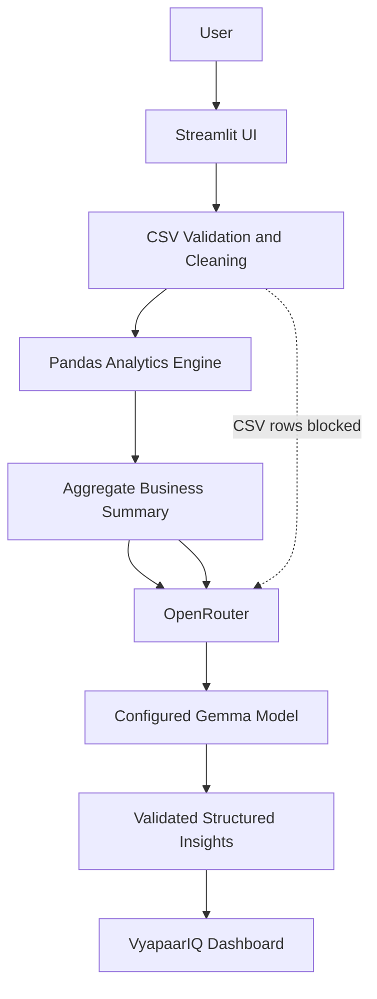

# VyapaarIQ

**Smart Insights for Every Business.**

VyapaarIQ is an open-source Streamlit MVP for small Indian businesses that want practical signals from everyday sales records. It accepts a CSV, validates and cleans it locally, calculates revenue metrics with Pandas, and optionally asks an LLM to explain the resulting aggregate summary.

## Overview

The product is designed for kirana stores, local retailers, home businesses, vendors, and independent sellers. Revenue is calculated by Python. The language model explains calculated signals; it is never the source of truth for financial calculations.

## Key Features

- CSV validation with safe cleaning, duplicate detection, and a 10 MB upload limit.
- Revenue, transactions, average bill, category share, weekday, date, and trend analysis.
- Category and daily revenue charts with a restrained business dashboard UI.
- OpenRouter integration through direct HTTP requests with configurable model (`google/gemma-4-26b-a4b-it:free`), timeout, retries, and reasoning enabled.
- Structured Pydantic AI responses requiring exactly three recommendations.
- Local rule-based recommendations when the API is unavailable.
- English, Hinglish, Hindi, and Marathi insight language selection.
- Aggregate-only AI prompts. Raw rows, item names, and customer information are not sent to the LLM.
- PDF business report, aggregate summary CSV, cleaned CSV, sample data, and bounded follow-up questions.

## How It Works



The LLM receives aggregate metrics such as revenue, transaction count, top category, weekday signals, and trend. It does not receive the original dataframe.

## Tech Stack

Python 3.11+, Streamlit, Pandas, NumPy, Plotly, Requests, Pydantic, python-dotenv, ReportLab, and pytest. The project is open source and uses an open-weight Gemma model through the OpenRouter API; OpenRouter itself is not claimed to be open source.

## Project Structure

```text
app.py                 Streamlit entry point
analytics.py           Local business calculations
ai_service.py          OpenRouter client and response validation
config.py              Environment-backed configuration
recommendations.py     Deterministic fallback recommendations
report.py              PDF and aggregate CSV exports
ui.py                  Reusable dashboard components
validation.py          CSV validation and cleaning
data/dummy_sales.csv   Deterministic demo dataset
tests/                 Unit tests without an API key
```

## Dataset Format

Required columns:

```csv
Date,Item_Name,Category,Amount_INR
2026-09-01,Rice 5kg,Grocery,450
```

`Quantity` is optional. If it is absent, VyapaarIQ does not claim to know units sold. Revenue is not profit, net income, margin, or cash flow.

## Setup

PowerShell on Windows:

```powershell
python -m venv .venv
.venv\Scripts\Activate.ps1
pip install -r requirements.txt
Copy-Item .env.example .env
```

Set `OPENROUTER_API_KEY` in `.env`, or enter a key temporarily in the application. Never commit `.env` or `.streamlit/secrets.toml`.

## Environment Variables

```text
OPENROUTER_API_KEY=
OPENROUTER_MODEL=google/gemma-4-26b-a4b-it:free
OPENROUTER_FALLBACK_MODEL=
OPENROUTER_TIMEOUT=30
OPENROUTER_RETRIES=2
MAX_UPLOAD_MB=10
OPENROUTER_SITE_URL=
OPENROUTER_SITE_NAME=VyapaarIQ
```

## Running Locally

```powershell
streamlit run app.py
```

Use **Try Sample Data** for a deterministic demo. Use **Generate AI insights** only when an OpenRouter key is available; the dashboard and local recommendations work without one.

## Testing

```powershell
pytest
```

Tests validate the structured response boundary and do not require an API key or network access.

## 60-Second Demo

1. Open VyapaarIQ and click **Try Sample Data**.
2. Show revenue, the category chart, and the weakest weekday.
3. Generate AI insights or show the local fallback.
4. Explain that only aggregate metrics go to the LLM.
5. Open the data explorer and download the summary report.
6. Upload another CSV to recalculate the dashboard.

## Privacy and Limitations

Detailed sales rows are processed by the application. The AI receives only an aggregated business summary. Session data is not persisted by a database, and chat context is bounded. Do not upload information you are not authorized to process. VyapaarIQ does not calculate GST, taxes, expenses, profit, customer lifetime value, inventory, or cash flow without the required fields. It is not a substitute for professional accounting or tax advice.

## Future Improvements

Possible next steps include richer quantity-based analysis, configurable business goals, additional local models, authenticated multi-user hosting, and optional encrypted persistence.

## Contributing

Fork the repository, create a branch, install the development requirements, run the tests, and open a pull request with a focused change and a short explanation. Please keep financial terminology accurate and preserve the aggregate-only AI boundary.

```powershell
git init
git add .
git commit -m "Initial VyapaarIQ release"
git branch -M main
git remote add origin YOUR_REPOSITORY_URL
git push -u origin main
```

## License and Attribution

VyapaarIQ is released under the MIT License. It uses Streamlit, Pandas, NumPy, Plotly, OpenAI's Python SDK, Pydantic, python-dotenv, ReportLab, and pytest under their respective licenses. The default model is an open-weight Gemma model accessed through OpenRouter; review the applicable model and provider terms before distribution.